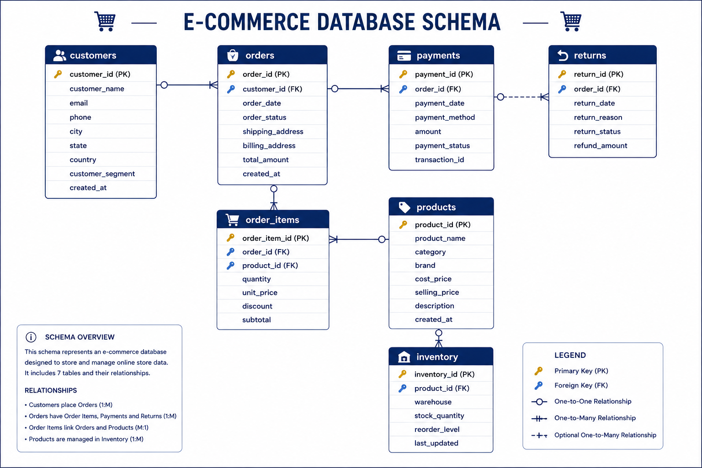

# 🛒 E-Commerce Sales Analysis — Advanced MySQL Project

An end-to-end SQL analytics project built entirely in **MySQL** on a 7-table relational e-commerce database: `customers`, `products`, `orders`, `order_items`, `payments`, `returns`, and `inventory`. This project takes raw CSV data all the way through database design, data loading, data quality checks, exploratory analysis, layered business-question SQL, advanced window-function analytics, index-based performance tuning, and a reusable views-and-stored-procedures reporting layer — the same structure used in real production analytics work.

## 📌 Project Overview

I built this project to simulate how a real company's sales data would actually be analyzed from scratch. It's not a single query file — it's a full pipeline: I started by creating the database schema and loading raw CSV files directly into MySQL, then checked the data for quality issues, explored it to understand its shape, wrote business-driven queries at increasing levels of complexity, added performance indexes, and finally packaged the most-used logic into views and stored procedures so reports can be regenerated on demand instead of rewritten every time.

## 🗄️ Database Schema

The database (`ecommerce_analytics`) has **7 interconnected tables**:

| Table | Key Columns |
|---|---|
| `customers` | customer_id, customer_name, city, segment |
| `products` | product_id, product_name, category, selling_price, cost_price |
| `orders` | order_id, customer_id, order_date, order_status |
| `order_items` | order_id, product_id, quantity |
| `payments` | order_id, amount, payment_method |
| `returns` | order_id, return_reason |
| `inventory` | product_id, warehouse, stock_quantity |

See the full ER diagram below (click to view full size):

## 🗂️ Repository Structure
- Dataset/ — raw CSV source files
- results/ — query output screenshots
- 00_ecommerce_schema_diagram.png — ER diagram
- E_COMMERCE_sql_table_DB_index_load_queries.sql — DB creation, CSV loading, indexing
- 01_Data_Cleaning.sql — NULL, duplicate, orphan-record checks
- 02_EDA.sql — exploratory data analysis
- 03_Basic_Analysis.sql — 10 foundational metric queries
- 04_Intermediate_Analysis.sql — 14 business-question queries
- 05_Advanced_Analysis.sql — 15 window-function/CTE queries
- 06_Index_Optimization.sql — performance indexing
- 07_Views.sql — 3 reusable reporting views
- 08_Stored_Procedures.sql — 3 callable stored procedures
- sql_extra_analysis.sql — quick summary-metric queries
- README.md
## 🛠️ Tech Stack & SQL Techniques Used

- **Database:** MySQL
- **Data Ingestion:** `LOAD DATA LOCAL INFILE` for CSV-to-MySQL loading
- **Joins:** Multi-table INNER/LEFT JOINs across 4–5 tables per query
- **CTEs:** `WITH` clauses for layered, readable query logic
- **Window Functions:** `RANK()`, `DENSE_RANK()`, `ROW_NUMBER()`, `NTILE()`, `LAG()`, `LEAD()`, `SUM() OVER`, `AVG() OVER`
- **Conditional Logic:** `CASE` statements for business segmentation (Gold/Silver/Bronze tiers)
- **Performance:** Single-column and composite indexing strategy
- **Reusability:** Views and stored procedures for repeatable reporting

## 🔍 What I Actually Did — Step by Step

### Step 1: Built the Database and Loaded Real Data
Created the `ecommerce_analytics` database from scratch, then used `LOAD DATA LOCAL INFILE` to load the `orders`, `order_items`, and `payments` datasets directly from CSV files into MySQL. Post-load, found `order_date` had loaded as text — fixed it using `ALTER TABLE ... MODIFY COLUMN` to convert it to a proper `DATE` type, required for any date-based analysis downstream.

### Step 2: Data Cleaning (`01_Data_Cleaning.sql`)
- Checked for **NULL values** across `customers`, `products`, `orders`, `order_items`
- Checked for **duplicate** `customer_id` / `order_id` using `GROUP BY ... HAVING COUNT(*) > 1`
- Flagged **invalid quantities** (zero/negative) in `order_items`
- Detected **orphan records** — order items with no matching parent order — using a `LEFT JOIN` and filtering where the parent key is `NULL`

### Step 3: Exploratory Data Analysis (`02_EDA.sql`)
Explored the dataset across **8 dimensions**:
- **Dataset overview** — total revenue, customers, products, orders, quantity sold
- **Sales overview** — average order value, monthly revenue trend (`DATE_FORMAT` grouping)
- **Customer overview** — by segment and by city
- **Product overview** — categories, top 10 sellers, revenue by category
- **Order overview** — by status, by month
- **Payment overview** — payment method distribution
- **Returns overview** — total, by reason, and return rate %
- **Inventory overview** — total stock, lowest-stock products

### Step 4: Basic Analysis (`03_Basic_Analysis.sql`)
**10 foundational queries**: customer/order/product counts, segment distribution, order status breakdown, top-selling products, customer distribution by city, average product price, warehouse inventory levels, returns count.

### Step 5: Intermediate Analysis (`04_Intermediate_Analysis.sql`)
**14 business-question-driven queries**, joining 3–4 tables at a time:
- Revenue by customer segment and by product category
- Top 10 customers by order count, top 10 products by revenue
- Monthly revenue and order volume trend
- Most-returned products and **return rate by category** (calculated two different ways for comparison)
- **Products never sold** — found via `LEFT JOIN` + `WHERE ... IS NULL` anti-pattern
- Inventory value by warehouse (`stock_quantity × cost_price`)
- Purchase frequency (`GROUP BY ... HAVING COUNT(*) > 5`)
- Revenue by city
- **Profit by category** — calculated as `quantity × (selling_price − cost_price)`, not just revenue
- Repeat customer analysis

### Step 6: Advanced Analysis (`05_Advanced_Analysis.sql`)
The most technical section — **15 queries using CTEs and window functions**:
- Customer revenue ranking with `RANK()`
- Top product per category using `ROW_NUMBER() OVER (PARTITION BY category ...)`
- **Running revenue total** using `SUM(revenue) OVER (ORDER BY month)`
- **Month-over-month growth** using `LAG(revenue) OVER (...)`
- **Rolling 3-month average** using `AVG(revenue) OVER (... ROWS BETWEEN 2 PRECEDING AND CURRENT ROW)`
- **Customer Lifetime Value (CLV)** calculation
- `DENSE_RANK()` vs `RANK()` comparison for customer ranking
- Product ranking by revenue using `RANK()`
- **Top 5 customers per city** using `ROW_NUMBER() OVER (PARTITION BY city ...)`
- Cumulative order count using windowed `SUM(COUNT(*))`
- **Revenue quartiles** using `NTILE(4)`
- `LAG()` / `LEAD()` on order dates to find each customer's previous/next order
- **Gold / Silver / Bronze customer segmentation** using `CASE` on revenue thresholds

### Step 7: Index Optimization (`06_Index_Optimization.sql`)
Added indexes on `orders(customer_id)`, `orders(order_date)`, `order_items(order_id)`, `order_items(product_id)`, `returns(order_id)`, plus composite indexes on `products`, `order_items`, and `orders` to speed up the heaviest joins used in the advanced analysis.

### Step 8: Views (`07_Views.sql`)
- `vw_sales_summary` — full order-level transaction detail
- `vw_customer_revenue` — pre-aggregated revenue per customer
- `vw_product_performance` — pre-aggregated quantity sold & revenue per product

### Step 9: Stored Procedures (`08_Stored_Procedures.sql`)
- `GetTopCustomers()` — top 10 customers by revenue
- `GetRevenueByCategory()` — revenue broken down by category
- `GetMonthlyRevenue()` — revenue grouped by year-month

## 📊 Key Business Insights

- Identified highest-value customers via revenue ranking + CLV, segmented into **Gold/Silver/Bronze** tiers
- Calculated **actual profit by category** (not just revenue) — surfaces categories that sell well but aren't the most profitable
- Tracked **month-over-month growth** and rolling 3-month average to gauge business momentum
- Measured **return rate by category** to flag quality/fit issues
- Found **products with zero sales** — a direct signal for inventory review
- Identified **top 5 customers per city** for regional account management

## 🚀 How to Reproduce

1. Clone this repository
2. Run `E_COMMERCE_sql_table_DB_index_load_queries.sql` first — creates the database, loads CSVs from `/Dataset`, fixes date types, builds indexes
3. Run in order: `01_Data_Cleaning.sql` → `02_EDA.sql` → `03_Basic_Analysis.sql` → `04_Intermediate_Analysis.sql` → `05_Advanced_Analysis.sql` → `07_Views.sql` → `08_Stored_Procedures.sql`
4. Check `/results` for output screenshots

## 📎 Related Projects

Part of a broader SQL/analytics portfolio — see more at [github.com/ankitabisht-data-analyst](https://github.com/ankitabisht-data-analyst)

